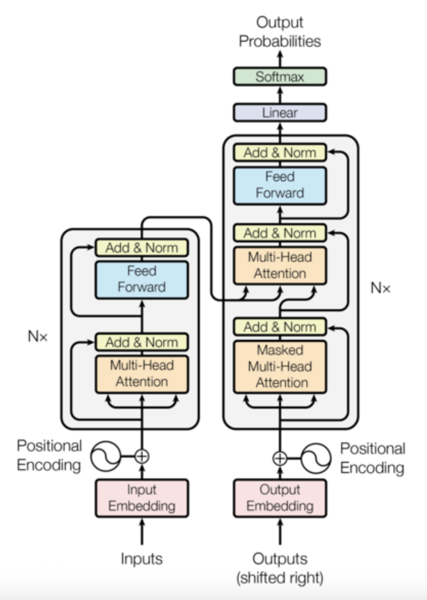

<h1 align='center'> Transformer </h1>

## **Goal:**

- Building a transformer-based model for Translation, Summarization and Q&A accordingly.
- Following the architecture in <a href="https://nlp.seas.harvard.edu/2018/04/03/attention.html" target="_blank">The Annotated Transformer</a>
- Comment each line of code with detailed understanding

## Background

- CNNs don’t inherently have difficulty learning distant dependencies, but doing so **efficiently** requires **significantly deeper or more complex architectures** (like dilated convolutions or residual networks), which **increases computational cost and model complexity**.

- The Transformer architecture leverages self-attention to model global dependencies in a single layer, enabling **parallel computation** and eliminating the need for sequential processing which improves efficiency over RNNs and CNNs for long-range relationships.

## Architecture

  

## **Translation**

## **Summarization**

## **Q&A**
